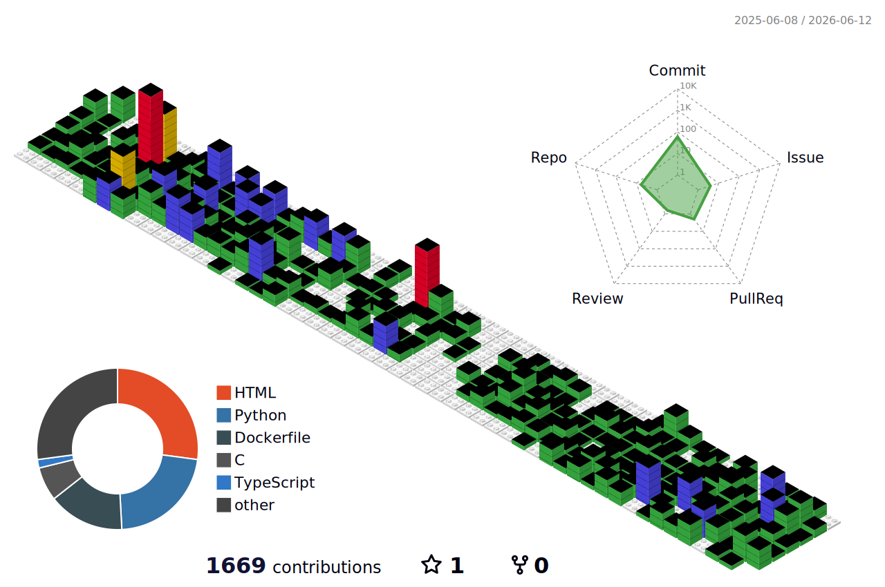

  
  

  
  
  

#### Stack principal

#### Databases

#### UI / Styling

#### Ferramentas

#### Estudando

 
  
<h4>Projetos</h4>

  

    
    
    
    
    
    
    
  

  

## Contatos

&nbsp;&nbsp;

