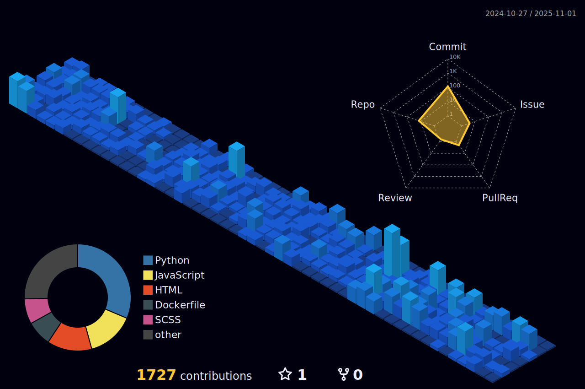

 

  

 
  
<h4>Projetos</h4>

  

    
    
    
    
    
    
  

  

 

 

  &nbsp;
 &nbsp;
 

 &nbsp;
 &nbsp;

&nbsp;

#### Estudando no momento:

#### Databases:
&nbsp;

#### Ferramentas:
&nbsp;
&nbsp;
&nbsp;
&nbsp;
&nbsp;
&nbsp;
&nbsp;

&nbsp;
&nbsp;

## Contatos:

 

&nbsp;&nbsp;
 
